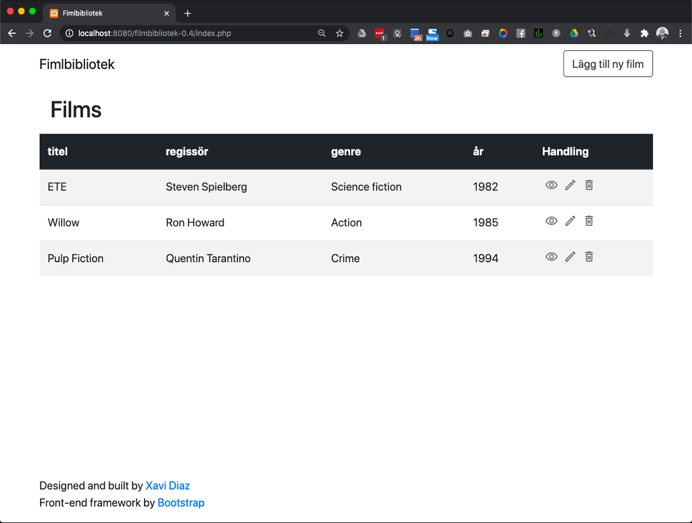

# filmbibliotek-0.4

Film Library.</br>
Allows Create Update Read Update library films index.

- Each film have Title, Director, Category and Production Year.
- There is a form to save new films in the library.
- Every film can be updated and removed from the database..

## Technologies

- [Bootstrap 4](https://getbootstrap.com/)
- [PHP 7](https://www.php.net/)
- [MySQL 8](https://www.mysql.com/)
- Html
- Css

## Database

Database communication would be with **prepared statements**, for reject SQL injections.

2 Related tables:

- **films** (id, title, director, cat_id, year)
- **categories** (cat_id, cat_name)

## Prerequisites

Before you begin, ensure you have met the following requirements:

<!--- These are just example requirements. Add, duplicate or remove as required --->

- You have a webserver.
- You have installed Apache and MySQL.

## Installing filmbibliotek

To install filmbibliotek, follow these steps:

- Upload files to your htcdocs directory server.
- Inport database located in the SQL folder (erase folder when installation is accomplished).
  > Edit [config.php](config.php) with your login server values. </br> > `define('DB_SERVER', 'your_host');` </br> > `define('DB_USERNAME', 'DB_username');` </br> > `define('DB_PASSWORD', 'DB_password');`

## Pages



## [Index.php](index.php)

Home page.</br>
List of the movies in the library.

## [skapa.php](skapa.php)

Create page.</br>
Where you can add new movies to your library.

## [film.php](film.php)

Read page.</br>
Where you can view more in detail a selected film from your library.

## [skapa.php](skapa.php)

Create page.</br>
Where you can add new movies to your library.

## [andra.php](andra.php)

Update page.</br>
Where you can update movies from your library.

## [config.php](config.php)

Setup connection database.</br>
(server, db_user, db_password, db_name).

## [fel.php](fel.php)

Error page.</br>
If something goes wrong.

## [readme.md](readme.md)

Project Documentation.

## [Images](Images)

Folder with images documentation.

## [SQL](SQL)

Folder with SQL commmands examples.

## [CSS/style.css](CSS/style.css)

Customs web styles.</br>

<hr>

## Tree

```
filmbibliotek-0.4
├─ Images
│  ├─ andra.gif
│  ├─ film.gif
│  ├─ filmbibliotek.gif
│  ├─ index.gif
│  ├─ radera.gif
│  └─ skapa.gif
├─ LICENSE.md
├─ README.md
├─ SQL
│  ├─ Dumping_data_for_table.sql
│  ├─ Table_structure_for_table.sql
│  └─ films.sql
├─ andra.php
├─ config.php
├─ css
│  └─ style.css
├─ fel.php
├─ film.php
├─ index.php
├─ radera.php
├─ skapa.php
└─ templates
   ├─ footer.php
   ├─ header.php
   └─ menu_draft.php

```

## Contact

If you want to contact me you can reach me at me@xavidiaz.com.

## License

This project uses the following license: [LICENSE.md](LICENSE.md).
